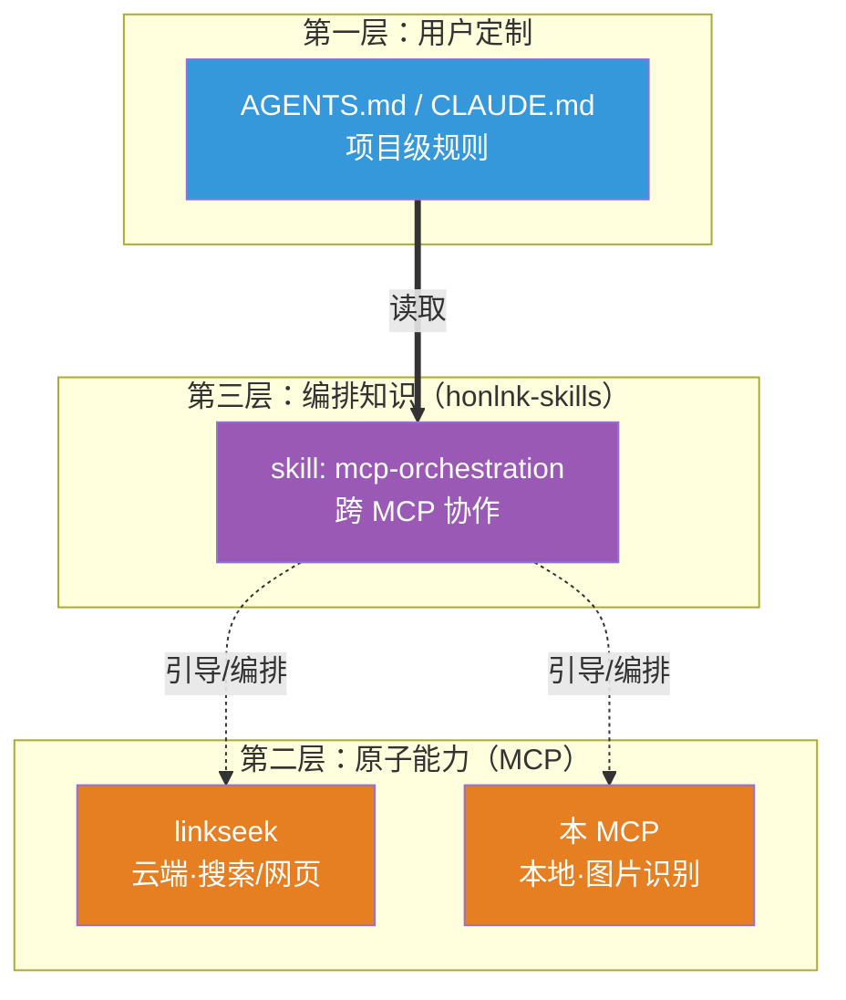

---
tags:
  - MCP
  - AI工具
  - 图片识别
  - 视觉模型
  - 设计文档
aliases:
  - picsense
  - 图片识别 MCP
  - 视觉 MCP
  - Vision MCP
date: 2026-07-21
status: ready
type: 设计文档
---

# picsense：图片识别 MCP 设计文档

> [!abstract] 项目定位
> 一款**本地安装**的图片识别 MCP，让任何基座模型（包括 GLM-5.2 这类单模态模型）都能通过 MCP 调用多模态能力识别图片。与已开源的 [[ai/tools/web-fetch-mcp-server-design|linkseek]] 同属个人 AI 工具生态，二者可由基座模型自主编排配合使用。

> [!info] 文档状态
> ✅ **ready - 设计定稿**。本文档由 ZCode（GLM-5.2）与作者共同讨论整理而成，核心设计已全部落地，可进入开发阶段。

---

## 一、为什么做这个 MCP

### 1.1 核心诉求

作者日常使用 ZCode（基座模型 GLM-5.2，**单模态**）进行开发，遇到一个根本性痛点：

> **单模态模型完全无法处理图片。** 用户在输入框粘贴/上传图片后，单模态基座模型既不能直接"看到"图片，也无法把图片信息编码后传给任何外部工具。

这意味着：错误截图分析、UI 还原、图表解读、技术图理解等所有需要视觉的场景，单模态模型一律做不了。本 MCP 的首要目的就是**补上这个能力缺口**，让作者在只用 GLM-5.2 时也能方便地识别图片内容。

### 1.2 与 linkseek 的关系（生态而非耦合）

本 MCP 与已开源的 linkseek 定位为**同一生态下的独立产品**：

- **linkseek**：云端托管，提供联网搜索 + 网页获取（文字层面）
- **本 MCP**：本地安装，提供图片识别能力（视觉层面）

二者**不做代码层面的耦合**，协作方式由基座模型自主编排。例如典型 workflow：

```
用户："分析这篇文章里这张架构图的设计是否合理"
  ↓
基座模型：调 linkseek.web_fetch 拿文章正文
  ↓
基座模型：从正文中识别出架构图 URL
  ↓
基座模型：调本 MCP.analyze_images 识别该图
  ↓
基座模型：综合文字 + 图片信息回答用户
```

#### 三层模型：honlnk 生态的职责分层

跨工具协作的编排知识，不在 MCP 内部硬编码（会违反单一职责，且并非所有用户都同时拥有两个工具），而是由独立的 **Anthropic Agent Skills** 层承载。Agent Skills 采用 **progressive disclosure（渐进披露）** 机制——未被触发的 skill 只占 name + description 的几十个 token，不拖累上下文；Agent 根据 task 自动判断是否加载。



| 层 | 受众 | 何时起作用 | 放什么 |
|---|---|---|---|
| **README** | 人在 GitHub 浏览时 | 被动阅读 | 每个 MCP 是什么、怎么装、独立能力 |
| **Skills** | Agent 运行时 | **自动加载**（靠 description 触发） | 跨工具编排、何时组合、workflow 范式 |
| **AGENTS.md** | 用户自己的项目 | Agent 每次启动读 | 用户私有定制、项目级规则 |

两个 MCP 本身**零耦合**，各自独立安装、独立工作；Skills 是独立的第三层，只承载「当同时拥有这两个工具时如何组合」的编排知识。详见 [[honlnk-skills-plan|honlnk-skills 计划]]（skills 的详细设计在**本 MCP 落地后**才启动）。

### 1.3 为什么是本地 MCP 而非云端

与 linkseek（云端托管）相反，本 MCP 选择**本地安装（stdio）**，基于以下判断：

| 维度    | 云端 MCP                             | 本地 MCP（本方案）                         |
| ----- | ---------------------------------- | ----------------------------------- |
| 外部依赖  | SearXNG、无头浏览器等重型依赖                 | **零外部依赖**（只调多模态 API）                |
| 部署成本  | 需要服务器 + 多个开源组件                     | `npx` 一行启动                          |
| 带宽压力  | 大（AI 交互走长连接，长时间占用服务器出站带宽）          | 不走网络（stdio 本地进程间通信）                 |
| 内存压力  | 普通用户买得起的云服务器（如 2c2g）资源有限，跑 AI 任务吃力 | 家用 PC 内存充裕，这点开销造不成压力                |
| 计费/鉴权 | 必须有 Key 管理 + 用量统计                  | 无需 Key，无需管理                         |
| 多端共享  | ✅ 天然支持                             | ❌ 每台设备独立配置                          |
| 网络依赖  | 全程服务端网络                            | MCP 通信走 stdio 不联网，但需联网调用第三方视觉模型 API |

**核心论据**：视觉模型 API 调用本质就是 LLM gateway 的活，不需要任何开源依赖。云端部署除了徒增带宽和内存压力（对小服务器尤其不友好），没有任何收益。本地 stdio 反而是这类工具的主流形态（市面上几乎所有图片 MCP 都这么做）。

> [!note] 网络依赖说明
> 本地 MCP 自身的通信（Agent ↔ MCP）走 stdio，不联网。但识图能力依赖第三方视觉模型，调用模型 API 时需要联网——这部分流量走用户自己的网络，不经过任何 MCP 服务器。

---

## 二、与智谱 `@z_ai/mcp-server` 的定位差异

市面上最直接的参考是智谱官方的视觉理解 MCP（`@z_ai/mcp-server`，基于 GLM-4.6V）。但其定位与本 MCP **几乎完全不一致**，本节明确差异，避免被其设计带偏。

### 2.1 智谱方案的核心特征

- **按场景拆 8 个工具**：`ui_to_artifact` / `extract_text_from_screenshot` / `diagnose_error_screenshot` / `understand_technical_diagram` / `analyze_data_visualization` / `ui_diff_check` / `analyze_image` / `analyze_video`
- **每个工具内置一套精心调优的 system prompt**：8 个 prompt 文件均采用 `<task><approach><output_structure>` 三段标签结构，角色设定以 "You are a..." 开头散文形式写在标签外；强制结构化输出。其中 `ui_to_artifact` 内含 `code`/`prompt`/`spec`/`description` 四个变体，实际模板总数 >8
- **默认模型 GLM-4.6V，可配置但仅面向智谱生态**：`Z_AI_VISION_MODEL` 环境变量可覆盖默认值，`Z_AI_BASE_URL` 也可自定义，但 `PLATFORM_MODE` 预设只支持 ZAI / ZHIPU 两个平台
- **stdio 本地部署**

### 2.2 本 MCP 的反方向选择

| 维度        | 智谱方案                   | 本 MCP                                  |
| --------- | ---------------------- | -------------------------------------- |
| 工具拆分      | 按场景拆 8 个               | **不按场景拆**（见 §4 分析）                     |
| Prompt 来源 | 内置精心调优的 prompt         | **由基座模型实时生成**                          |
| 模型        | 默认 GLM-4.6V（可配但仅限智谱生态） | **任意 provider 自配**（首推 ChatGPT-5.6-sol 等世界最强多模态） |
| 部署        | stdio                  | stdio                                  |
| 多轮迭代      | 不支持                    | **支持**（核心差异化）                          |

### 2.3 不按场景拆工具的论据

智谱的"按场景拆工具"本质上是一种 **"不信任基座模型"的旧思路** ——把 prompt 工程硬编码进 tool。但现代基座模型（GPT / Claude / GLM-5.2 等）**自己生成 prompt 的能力已经非常优秀**，即便任务中临时生成的 prompt，效果都不输精心调优的固定 prompt。

按场景拆工具的代价：
- 工具数量爆炸，模型选择成本上升
- 每个工具的边界模糊，模型容易调错
- 新增场景需要发版

不拆工具的收益：
- 极简的 API 表面
- 基座模型根据用户意图自主决定 prompt
- 场景扩展零成本

---

## 三、核心差异化设计：多轮迭代识别

这是本 MCP **最核心的差异化点**，市面上几乎所有图片识别 MCP 都没做这件事。

### 3.1 问题背景

传统图片识别 MCP 是"一次性"的：用户/AI 给一张图 + 一个 prompt，MCP 调一次多模态模型，返回描述，结束。

但这有一个严重问题：**一次性的视觉描述很容易不够详细或不够准确**，尤其是：
- 复杂 UI 截图（细节多，单次描述覆盖不全）
- 用户实际只关心某个局部（但模型不知道）
- 后续代码更新基于错误的图片描述进行，导致连锁错误

### 3.2 设计目标

允许基座模型在处理用户需求的过程中，**多次调用本 MCP**：

```
第 1 轮：基座模型 → MCP（图 + 初始 prompt）→ 创建 session，返回描述 A + session_id
                                       ↓
基座模型判断：描述 A 是否满足用户需求？
                                       ↓ 不满足
第 2 轮：基座模型 → MCP（session_id + 新 prompt）→ 在已有 session 基础上追加，返回描述 B
                                       ↓
                              ... 直到满足 ...
                                       ↓
基座模型：基于最终描述，继续处理用户需求
```

### 3.3 关键能力：任务进行中重新阅读图片

更进一步：基座模型在处理用户需求**进行过程中**，可以随时重新调本 MCP 阅读用户最初发送的图片，保障在最新的状态中获取到图片中最有用的信息。

> [!example] 典型场景
> 用户发送一张复杂的设计稿 + "帮我还原这个页面"。
> - 基座模型先调 MCP 拿到整体描述，开始写代码
> - 写到某个组件时发现细节不清，**重新调 MCP**，prompt 改为"重点描述导航栏的样式"
> - 拿到精确描述后继续写
>
> 这种"边干边查"的能力，是一次性识别方案做不到的。

### 3.4 返回结果：不带元信息，只返回识别内容

MCP 返回结果只返回识别内容本身（描述文本），不附带任何元信息（第几轮、用了什么 prompt、模型耗时等）。

> [!important] 调研结论（Codex + OpenCode 源码确认）
> AI agent 调用 MCP 工具后，**tool call 的输入参数和返回结果都会被完整存入对话历史**，并在后续每一轮 LLM 请求中原样带上。
>
> - **Codex**（Rust）：工具调用的 `arguments`（JSON）存为 `ResponseItem::FunctionCall`，MCP 返回内容存为 `ResponseItem::FunctionCallOutput`，两者都进入 `ContextManager.items`，下一轮经 `for_prompt()` 全量发给模型。
> - **OpenCode**（TypeScript）：工具调用的 `input` 和 MCP 返回的 `output` 都持久化为 `ToolPart.state`（SQLite），每轮经 `toModelMessagesEffect()` 重建为标准 `tool-call` + `tool-result` 消息发给模型。

基座模型从对话历史中即可自行获取一切决策所需的信息：

| 元信息 | 基座模型是否已知 | 结论 |
|-------|----------------|------|
| 第几轮 | ✅ 上下文里有完整的历次调用记录，自己数得出来 | 无需 MCP 提供 |
| 用了什么 prompt | ✅ 上一轮的 `arguments` 原样在历史里 | 无需 MCP 提供 |
| 模型耗时 | ❌ 不知道 | 与识别质量决策无关，属调试信息，不暴露 |

这与 §2.3 的哲学一致——prompt 控制权交给基座模型，MCP 不干预 prompt 内容。

### 3.5 实现要点

- MCP 不负责"判断是否满足需求"——这个判断由基座模型完成
- MCP 只负责：接收 image_sources + prompt，调多模态模型，返回纯文本描述
- 多轮迭代通过 MCP 侧的 **session 机制**实现——MCP 维护与视觉模型的完整对话历史，基座模型只需传递 sessionId，详见 §4.2

---

## 四、工具设计

### 4.1 工具总览

**不按场景拆，按输入形态拆**（理由见 §2.3）。同时增加一个会话管理工具，支撑多轮迭代：

| 工具 | 输入 | 用途 |
|------|------|------|
| `analyze_images` | 图片数组 + prompt + session_id? | 图片识别 + 多轮迭代（核心工具，传一张是单图，传多张是批量/对比） |
| `analyze_document` | 文档（URL/HTML/markdown） | 解析文档，识别其中所有图片，返回标注了图片描述的完整文档 |
| `list_sessions` | 无 | 查看当前所有 session 的列表 + 简介 |

**为什么这样拆**：
- **不按场景拆**（不搞 OCR/UI/图表独立工具）——见 §2.3 论据
- **按输入形态拆**——图片 vs 文档，schema 完全不同，强行塞一个工具会让参数很乱
- **单图与多图合并**——`image_sources: string[]` 统一处理，传一张是单图，传多张是批量/对比，没有必要拆成两个工具
- **`analyze_document` 独立**——职责完全不同，输入文档、输出标注文档，与 `analyze_images` 的「输入图片、返回描述」是两种工作模式
- **`list_sessions` 独立**——让基座模型能随时查看历史 session，恢复上下文记忆

### 4.2 Session 机制：多轮迭代的核心

MCP 通过 session 机制管理与视觉模型的完整多轮对话历史，基座模型只需传递一个 `session_id` 字符串即可在已有对话基础上继续迭代。视觉模型拿到的是**原生多轮对话**（完整的 messages 数组），而非被压扁成单轮 prompt 文本。

#### 4.2.1 session 的数据结构

```typescript
interface Session {
  id: string                   // session 唯一标识
  summary: string              // 简介，由视觉模型生成（见 4.2.3）
  imageSources: string[]       // 图片引用数组（URL / path / base64）
  messages: VisionMessage[]    // 发给视觉模型的完整多轮对话历史
  createdAt: timestamp
  lastAccessAt: timestamp
}
```

#### 4.2.2 生命周期

| 阶段 | 触发 | 行为 |
|------|------|------|
| **创建** | 首次调用 `analyze_images`（不传 `session_id`） | MCP 内部创建 session，返回 `session_id` |
| **追加** | 后续调用时传入 `session_id` | MCP 找到对应 session，将新 prompt 追加到 `messages`，调视觉模型 |
| **过期** | 距 `lastAccessAt` 超过 **24 小时** | 定时任务清理，session 被移除 |
| **销毁** | MCP 进程退出 | 全部 session 自然清空（内存态，不持久化），基座模型走首次调用即可重建 |

#### 4.2.3 summary 的生成

首次调用创建 session 时，**让视觉模型在返回描述的同时生成一句简介**，与 `session_id` 一并返回。

#### 4.2.4 并发隔离

多 Agent（或单 Agent 并行多工具调用）可能同时操作不同 session，甚至同一 session 发起多轮。隔离方案：

| 场景 | 处理方式 |
|------|---------|
| **不同 session 并发** | 天然隔离，互不干扰——每个 session 独立，并行执行 |
| **同一 session 并发写** | session 级互斥锁（`Map<session_id, Mutex>`），同一 session 的请求串行执行，避免 messages 数组写冲突 |
| **list_sessions 并发读** | 读快照（浅拷贝列表），不阻塞写操作 |
| **清理任务** | 跳过正在使用的 session（检查锁状态） |

实际并发瓶颈不在 MCP 本地，而在视觉模型 API 的 rate limit——这部分由 provider adapter 自带的重试机制处理，不需要 MCP 层额外管理。

#### 4.2.5 工具参数 schema

> [!info] 关于 `image_sources` 的数据类型
> 详见 [[#5.3.5 调研结论：image_sources 需要支持的输入形态]]。核心结论：不同 Agent 传递图片的形态不同（ZCode 传 http URL，Claude Code / OpenCode / Codex 传本地文件路径），MCP 作为被调用方无法控制上游，因此设计为 **string 类型，自动识别**（URL / 文件路径 / base64 三种形态兼容）。

每个工具的 `description` 和各参数的 `description` 是 MCP 注册时暴露给 Agent 的说明文字。现阶段只写简洁描述，详细的 prompt 工程教程留给后续的 Skills 层。

##### `analyze_images`

```typescript
// tool description: "识别图片内容。传入一张图片为单图识别，传入多张为批量或对比识别。支持多轮迭代——首次调用创建 session，后续调用传入 session_id 可在已有对话基础上追加提问。"

// 输入
{
  image_sources: string[],     // 图片来源数组（传一张为单图识别，传多张为批量/对比），每项自动识别 http URL / 本地文件路径 / base64
  prompt: string,              // 对图片的识别要求，根据当前任务意图编写
  session_id?: string          // 传入已有 session 的 ID 以发起后续轮次；不传则创建新 session
}

// 返回
{
  session_id: string,          // 本次调用所属的 session
  summary: string,             // session 简介（首次调用时由视觉模型生成，后续轮次原样返回）
  description: string          // 识别结果（纯文本）
}
```

##### `list_sessions`

```typescript
// tool description: "查看当前所有识别会话的列表，包括每个 session 的简介、关联图片和迭代轮数。用于回顾历史识别记录。"

// 输入：无

// 返回
{
  sessions: Array<{
    session_id: string,        // session 唯一标识
    summary: string,           // session 简介
    image_sources: string[],   // 关联的图片（截断显示）
    last_access_at: timestamp, // 最后访问时间
    iteration: number          // 已迭代轮数
  }>
}
```

##### `analyze_document`

```typescript
// tool description: "解析文档，识别其中所有图片的内容，并在图片位置旁标注描述。返回标注后的完整文档。"

// 输入
{
  document: string             // 文档 URL / HTML / markdown（自动识别）
}

// 返回
{
  document: string             // 标注了图片描述的完整文档
  images_analyzed: number      // 本次识别了多少张图
}
```

**职责单一**：输入文档，输出文档。工具内置识别 prompt，不接收外部 prompt 参数。哪些图片值得识别、识别到什么程度，全部交给基座模型结合上下文判断——MCP 不预设任何筛选规则。

**标注格式**：在原文档的图片位置旁用注释标记描述，不破坏原文档渲染。以 markdown 为例：

```markdown

<!-- image-vision: 这是一个三层架构图，包含前端层、API 网关层和数据层... -->
```

基座模型拿到标注后的文档，自行结合上下文判断哪些图片信息对其任务有用。如果对某张图需要更详细的描述，可用 `analyze_images` 单独精修。

### 4.3 视频识别（计划功能，暂不做）

视频识别是后续计划的扩展方向，但**当前阶段明确不做**。后续启动时再单独讨论参数 schema 和实现方案。

---

## 五、市场调研：现有方案全景

> [!info] 调研范围
> 本次调研覆盖了主流的图片/视觉 MCP 和相关的 Agent 插件，重点关注工具设计、参数 schema、底层实现三个维度。调研时间为 2026 年 7 月。

### 5.1 三大流派

市面上的方案分成 3 大流派，定位完全不同：

| 流派 | 代表项目 | 特点 | 与本 MCP 的关系 |
|------|---------|------|---------------|
| **A. 大模型 API 封装派** | 智谱 `@z_ai/mcp-server`、`@systemmin/image-mcp`、`lengbone/mcp-vl`、`ai-vision-mcp` | 把 Claude/GLM/Gemini/Ollama 的 vision API 包一层 | **本 MCP 属于这一派** |
| **B. 传统 CV 工具派** | `opencv-mcp-server`、`imagesorcery-mcp` | 用 OpenCV/YOLO 做像素级处理 | 与本 MCP 无关，但提供思路（某些任务传统 CV 比 LLM 快/准/便宜） |
| **C. 专项定制派** | Perceptron Vision MCP、Azure AI Vision MCP | 垂直领域定制 | 与本 MCP 无关 |

### 5.2 流派 A 详细对比

#### 5.2.1 智谱官方 `@z_ai/mcp-server`（已读源码，见附录 A）

- **模型**：默认 GLM-4.6V，通过 `Z_AI_VISION_MODEL` 环境变量可配置，但 `PLATFORM_MODE` 预设仅支持 ZAI / ZHIPU 两个平台
- **工具**：8 个专项工具 + 1 个通用兜底 + 1 个视频
- **亮点**：system prompt 工程精湛（8 套结构化 prompt），官方背书
- **局限**：工具过度拆分、模型配置仅面向智谱生态（非任意 provider）、不支持多轮迭代
- **与本 MCP 的差异**：见 §2.2

#### 5.2.2 `@systemmin/image-mcp`（多 provider 抽象最干净）

- **模型**：Claude / 智谱 / Ollama，运行时 `provider` 参数动态切换
- **工具**：3 个（`vision_describe` / `vision_qa` / `vision_analyze`）
- **亮点**：**`VisionProvider` 接口设计最干净**——3 个 tool 共用同一接口，新增 provider 只需实现接口
- **架构**：

```text
src/
├── index.ts              # MCP 入口，注册 3 个工具
├── providers/
│   ├── index.ts          # VisionProvider 接口 + getProvider 工厂
│   ├── anthropic.ts      # Claude 适配器
│   ├── zhipu.ts          # 智谱适配器
│   └── ollama.ts         # Ollama 适配器
└── utils/
    ├── image.ts          # 图片读取 + base64 + MIME 推断
    └── config.ts         # 环境变量加载
```

> [!tip] 这个项目的 provider 抽象是本 MCP 多模型支持的直接参考蓝本。

#### 5.2.3 `lengbone/mcp-vl`（剪贴板输入 + 专注代码图）

- **模型**：GLM-4.5V
- **工具**：1 个（`auto_analyze_image`）
- **亮点**：支持**剪贴板输入**；`focusArea` 参数提供 4 种模式（code/architecture/error/documentation）
- **局限**：只支持智谱一家；专注代码截图，场景窄

#### 5.2.4 `tan-yong-sheng/ai-vision-mcp`（功能最全）

- **模型**：Gemini / Vertex AI
- **工具**：5 个（`analyze_image` / `compare_images` / `detect_objects_in_image` / `audit_design` / `analyze_video`）
- **亮点**：含**UI 设计审计**（K-means 提主色 + Sobel 算复杂度 + WCAG 公式算对比度 + Gemini 给建议）；视频支持 YouTube URL
- **局限**：只支持 Google 系模型；5 个工具还是偏多

### 5.3 Agent 图片输入机制调研（关键）

> [!warning] 这是设计 `image_sources` 参数的前置条件
> 用户在 Agent 输入框粘贴/选择图片后，图片最终以什么形态到达 MCP 工具，直接决定了 `image_sources` 参数要接收什么类型的数据。

#### 5.3.1 ZCode 的图片保底机制（实测确认）

ZCode 在检测到当前使用的模型**不是多模态模型**时，会主动执行一套兜底流程：

```text
用户粘贴图片到输入框
  ↓
ZCode 在后台静默上传图片到智谱 UCloud 对象存储（图床）
  ↓
生成带签名的预签名 URL（presigned URL，有 Expires 时效）
  ↓
基座模型收到的是 URL（单模态模型自己看不到图片）
  ↓
ZCode 自动扩写 prompt（将用户的简短提问扩写为更详细的分析指令）
  ↓
调用内置 MCP 工具（analyze_image），把 URL 作为 imageSource 传过去
  ↓
MCP 工具用这个 URL 调 GLM-4.6V 识别，返回文字描述
```

以上流程均由 ZCode 客户端自身完成，与本 MCP 无关。但这个流程揭示了一个**至关重要的结论**：

> [!important] 调研最终结论
> 在 ZCode + 单模态模型（如 GLM-5.2）的场景下，用户粘贴的图片最终被处理为 **http URL** 到达 MCP 工具。不是本地文件路径，也不是 base64。

#### 5.3.2 多模态模型 vs 单模态模型的行为差异（实测对比）

同一台 ZCode 客户端，同样的粘贴操作，图片的命运取决于基座模型是否多模态：

| | 多模态模型（如 GPT） | 单模态模型（如 GLM-5.2） |
|---|---|---|
| 用户操作 | 粘贴图片 + 提问 | 同样操作 |
| 图片发送形态 | File attachment（内联） | 上传图床 → URL |
| 是否调用 MCP | ❌ 不调用，模型直接消费 | ✅ 调用 analyze_image |
| prompt 改写 | 无 | 扩写为更详细的分析指令 |

**多模态模型**：图片直接编码进 API 请求的 messages 数组（base64 inline），模型原生就能看到图片，**完全不走 MCP**。

**单模态模型**：ZCode 触发保底机制，把图片转成 URL，路由到 MCP 工具。

#### 5.3.3 其他 Agent 的情况

| Agent | 保底机制 | MCP 接收的图片形态 | 说明 |
|-------|---------|----------------|------|
| **ZCode** | ✅ 有（内置） | **http URL**（图床预签名） | 单模态模型时：上传图床 → URL → 内置 MCP |
| **Claude Code** | ❌ 无 | **本地文件路径** | 单模态模型粘贴图片直接报错。GLM 是唯一例外——智谱提供了配套视觉 MCP，Claude Code 会主动调用，传文件路径 |
| **Codex CLI** | ❌ 无 | **本地文件路径** | 原生面向多模态 GPT 模型设计，不支持单模态模型场景。图片通过 `--image` flag 或粘贴附加，模型直接消费 |
| **OpenCode** | ❌ 无（需插件） | **本地文件路径**（插件落盘） | 核心框架无保底机制，单模态模型粘贴图片报错。但插件生态丰富，`opencode-vision` 插件会自动拦截粘贴图片 → 保存临时文件 → 注入路径给 MCP |

> [!note] 结论来源
> - Claude Code / Codex CLI / OpenCode 均为开源或有丰富官方文档的项目，以上结论基于官方文档 + 源码/插件源码分析。
> - Claude Code 单模态报错基于作者使用 Mimo 模型的实际经验；GLM 例外基于智谱官方文档确认。

#### 5.3.4 四大工具汇总

| | ZCode | Claude Code | Codex CLI | OpenCode |
|---|---|---|---|---|
| **保底机制** | ✅ 有（内置） | ❌ 无 | ❌ 无 | ❌ 无（需插件） |
| **多模态模型** | 图片直接消费 | 图片直接消费 | 图片直接消费 | 图片直接消费 |
| **单模态+图片** | 上传图床 → URL → 内置 MCP | ❌ 报错（GLM 例外） | ❌ 默认多模态 | ❌ 报错（需插件桥接） |
| **MCP 接收形态** | **http URL** | **本地文件路径** | **本地文件路径** | **本地文件路径**（插件落盘） |
| **开源** | ❌ | ❌ | ✅ | ✅ |

#### 5.3.5 调研结论：image_sources 需要支持的输入形态

上述全部调研工作，目的是确认本 MCP 工具的 `image_sources` 参数（图片数组，对应 `analyze_images`）应该接收什么类型的数据。数组中每一项的输入形态要求一致，结论如下：

| 输入形态 | 来源场景 | 必须支持？ |
|---------|---------|----------|
| **http URL** | ZCode 保底机制（图片上传图床后以预签名 URL 传入）；linkseek 抓取网页后识别文中配图 | ✅ 必须 |
| **本地文件路径** | Claude Code / OpenCode / Codex 场景（图片存本地，以路径传入 MCP） | ✅ 必须 |
| **base64** | 兜底兼容（四大主流工具都不直接传 base64 给 MCP，但不排除少数 client 会这么做） | ⚠️ 兜底 |

> [!important] 设计决策
> `image_sources` 设计为 **string 数组类型，每项自动识别**（URL / 文件路径 / base64），而非强制单一类型。原因：四大主流 Agent 对图片的传递形态不同，MCP 作为被调用方无法控制上游传什么，只能**兼容并自动识别**。
>
> 这与智谱 `@z_ai/mcp-server` 的设计一致（它支持 URL + 文件路径），但我们额外支持 base64 作为兜底。

#### 5.3.6 prompt 改写的问题（做本 MCP 的动机之一）

ZCode 在调用 MCP 工具前会自动扩写 prompt，但这个能力**有限且容易出错**。实测验证：

> 把一张头像图片重命名为「页面布局.png」，粘贴到 ZCode 输入框，问"图片中的内容是什么"。ZCode 果然根据文件名「页面布局」来编写识别提示词，最终识别结果从出发点就已经产生误差，后续误差只会越来越大。

这正是作者不用 ZCode 内置 MCP、要自己做一个的核心原因之一：**把 prompt 的控制权交还给用户/基座模型，由 Agent 根据任务上下文自行生成、迭代，而非被客户端的简单改写规则误导。**

---

## 六、技术栈与实现方向

### 6.1 技术栈建议

| 维度          | 建议                          | 理由                              |
| ----------- | --------------------------- | ------------------------------- |
| 语言          | TypeScript（Node.js）         | 与 linkseek 一致，生态成熟，MCP SDK 一等公民 |
| 包管理工具      | `pnpm`                        | 安装快、磁盘占用低，适合轻量依赖的开源 TypeScript 项目 |
| MCP 传输      | stdio                       | 本地 MCP 的主流形态，所有竞品都这么做           |
| MCP SDK     | `@modelcontextprotocol/sdk` | 官方 SDK                          |
| 参数校验        | zod                         | SDK 内置支持                        |
| 多 provider  | `VisionProvider` 接口         | 参考 `@systemmin/image-mcp`       |
| 首版 provider | OpenAI（ChatGPT-5.6-sol）     | 作者明确倾向"世界最好的多模态模型"              |
| 后续 provider | Qwen / Kimi                 | 按需扩展                            |

### 6.2 配置方式

参考 `@systemmin/image-mcp` 的环境变量方案，通过环境变量配置各 provider 的 API Key 和模型名，不在代码内部硬编码：

```bash
# 默认 provider
DEFAULT_PROVIDER=openai

# OpenAI
OPENAI_API_KEY=sk-xxx
OPENAI_MODEL=chatgpt-5.6-sol

# Qwen
QWEN_API_KEY=xxx
QWEN_MODEL=qwen-vl-max

# Kimi
KIMI_API_KEY=xxx
KIMI_MODEL=moonshot-v1-vision
```

### 6.3 项目结构

```text
picsense/
├── package.json
├── tsconfig.json
├── src/
│   ├── index.ts                  # MCP Server 入口
│   ├── tools/
│   │   ├── analyze-images.ts     # 图片识别 + 多轮迭代（单图/多图统一）
│   │   ├── analyze-document.ts   # 文档图片标注
│   │   └── list-sessions.ts      # 会话列表
│   ├── providers/
│   │   ├── index.ts              # VisionProvider 接口 + 工厂
│   │   ├── openai.ts             # OpenAI 适配器
│   │   ├── qwen.ts               # Qwen 适配器
│   │   └── kimi.ts               # Kimi 适配器
│   ├── core/
│   │   ├── image-loader.ts       # 图片加载（路径/URL/base64 自动识别）
│   │   └── session-manager.ts    # Session 生命周期 + 并发隔离
│   └── utils/
│       └── config.ts             # 环境变量配置管理
└── README.md
```

### 6.4 图片大小限制

单张图片限制 **5MB**，格式支持 jpg / jpeg / png。

---

## 七、开源计划

本项目与 linkseek 一样计划开源。开源后需要：

- [ ] 完整的 README（说明独立能力，跨工具协作留给 honlnk-skills）
- [ ] ZCode 接入指南（其他 Agent 暂不考虑）
- [ ] 多 provider 配置示例（OpenAI / Qwen / Kimi）

### 7.1 与 honlnk-skills 的关系（配套但独立）

本 MCP 的 README **只描述自身能力**，不内置任何「建议配合 linkseek 使用」的引导——那属于 [[honlnk-skills-plan|honlnk-skills]] 的职责。

honlnk-skills 是作者个人生产力 Skills 合集，作为两个 MCP 之上的**编排层**：

| 项目 | 层 | 定位 | 仓库 |
|------|---|------|------|
| linkseek | 原子能力（云端） | 联网搜索 + 网页获取 | 独立仓 |
| **本 MCP** | 原子能力（本地） | 图片识别 | 独立仓 |
| **honlnk-skills** | 编排层 | 跨 MCP 协作 workflow + 个人规范 | 独立仓（一仓多 skill） |

**三者的关系**：各自独立开源、互不依赖。Skills 引用 MCP 但不要求 MCP 存在；MCP 不感知 Skills。用户可只装其中一个，也可三者全装获得完整生态体验。

> [!note] 时机
> honlnk-skills 的首个 skill（`mcp-orchestration`）**在本 MCP 落地后**才启动详细设计，现阶段不在 MCP 开发前做。

---

## 八、后续讨论清单

> [!important] 本节是后续与作者讨论的 agenda，每项讨论完后更新对应章节并打勾

### 生态层面

- [ ] 与 linkseek 的协作 workflow 文档化（交给 [[honlnk-skills-plan|honlnk-skills]] 的 `mcp-orchestration` skill 承载）
- [ ] honlnk-skills 的首个 skill 启动时机（本 MCP 落地后）
- [ ] 三层模型在 README / Skills / AGENTS.md 的内容边界确认

### 调研层面

- [ ] OpenAI / Qwen / Kimi vision API 的官方文档深挖（实现前必做）
- [ ] `@systemmin/image-mcp` 源码精读（provider 抽象参考）
- [ ] 视频识别方案调研（后续启动时）

---

## 附录 A：智谱 `@z_ai/mcp-server` 源码分析报告

> [!info] 分析来源
> 通过 `npm pack @z_ai/mcp-server@latest`（v0.1.4）获取官方发布的 npm 包并解压，直接阅读其 `build/*.js`（编译产物）。包为 Apache-2.0 开源协议，源码阅读完全合规。

### A.1 包信息

- **包名**：`@z_ai/mcp-server`
- **版本**：0.1.4
- **协议**：Apache-2.0
- **作者**：`tomsun28` + `Web-Life`
- **依赖**：仅 `zod` + `@modelcontextprotocol/sdk`，零第三方 HTTP 库（直接用 fetch）

### A.2 架构总览

```text
┌─────────────────────────────────────────────────┐
│  index.js (StdioServerTransport)                │
│  注册 8 个 tool                                  │
└────────────┬────────────────────────────────────┘
             │ 每个 tool 一份代码：tools/*.js
             ▼
┌─────────────────────────────────────────────────┐
│  BaseImageAnalysisService (基类)                 │
│    processImageSource()   ← URL 直传/base64     │
│    executeVisionAnalysis() ← 拼 system+user+img │
│    validatePrompt()                             │
└────────────┬────────────────────────────────────┘
             │
             ▼
┌─────────────────────────────────────────────────┐
│  ChatService.visionCompletions()                │
│    POST {BASE_URL}/chat/completions             │
│    model: glm-4.6v  thinking:enabled            │
│    temperature:0.8  top_p:0.6  max_tokens:32768 │
└─────────────────────────────────────────────────┘
```

核心抽象：8 个 tool **共用同一个基类 + 同一个 API 调用**，区别只在 3 处：
1. 装载哪个 system prompt（来自 `prompts/*.js`）
2. 接收哪些参数
3. 用户 prompt 怎么被"增强"（拼接 hint/context）

### A.3 8 个 Tool 完整参数表

**共同模式**：
- `image_source`：本地路径 or 远程 URL 二合一（`isUrl()` 自动判断），URL 直传不转 base64
- `prompt`：必填，非空校验
- 第三个参数：可选的 "hint"，会拼到用户 prompt 后面，用 `<xxx_hint>...</xxx_hint>` 包起来

| # | Tool 名 | 必填参数 | 可选参数 | 用途 |
|---|---------|---------|---------|------|
| 1 | `ui_to_artifact` | `image_source`, `output_type` (enum: `code`/`prompt`/`spec`/`description`), `prompt` | — | UI 截图 → 4 种产物 |
| 2 | `extract_text_from_screenshot` | `image_source`, `prompt` | `programming_language` | OCR，可指定语言 |
| 3 | `diagnose_error_screenshot` | `image_source`, `prompt` | `context`（错误发生场景） | 错误截图诊断 |
| 4 | `understand_technical_diagram` | `image_source`, `posempt` | `diagram_type`（架构/流程/UML/ER/时序） | 技术图解读 |
| 5 | `analyze_data_visualization` | `image_source`, `prompt` | `analysis_focus`（趋势/异常/对比/指标） | 图表分析 |
| 6 | `ui_diff_check` | `expected_image_source`, `actual_image_source`, `prompt` | — | 双图对比，prompt 自动加 "第一张是预期/第二张是实际" |
| 7 | `analyze_image` | `image_source`, `prompt` | — | 通用兜底 |
| 8 | `analyze_video` | `video_source`, `prompt` | — | 视频，MP4/MOV/M4V，≤8MB |

### A.4 关键设计细节

1. **输入只支持两种**：本地路径、HTTP(S) URL。**没有 base64 入参**——base64 只在内部对本地文件做转换
2. **图片格式白名单**：仅 `.jpg/.jpeg/.png`（硬编码），webp/gif 都会被拒
3. **图片大小限制**：5MB（图片）/ 8MB（视频），写死在类属性
4. **重试机制**：所有 tool 都包了 `withRetry(fn, 2, 1000)`——最多重试 2 次，间隔 1 秒
5. **超时**：300 秒（`Z_AI_TIMEOUT=300000`）
6. **video URL 直传，不 base64**；本地视频才转 base64

### A.5 底层 API 调用（GLM-4.6V）

```javascript
POST https://open.bigmodel.cn/api/paas/v4/chat/completions
Authorization: Bearer ${Z_AI_API_KEY}
X-Title: 4.5V MCP Local

{
  "model": "glm-4.6v",           // 可用 Z_AI_VISION_MODEL 覆盖
  "messages": [
    { "role": "system", "content": <场景化 system prompt> },
    { "role": "user", "content": [
        { "type": "image_url", "image_url": { "url": <url 或 base64> } },
        { "type": "text", "text": <用户 prompt + hint> }
    ]}
  ],
  "thinking": { "type": "enabled" },   // ⭐ 启用思维链
  "stream": false,
  "temperature": 0.8,
  "top_p": 0.6,
  "max_tokens": 32768
}
```

值得注意的点：
- 走的是**标准 OpenAI chat/completions 兼容协议**，不是智谱私有协议。意味着换 OpenAI/Gemini 只需改 URL + 字段微调
- `thinking: enabled` 是 GLM-4.6V 特有的思维链开关，会显著提升准确率但增加延迟
- messages 结构是 OpenAI 多模态标准：`image_url.url` 既可以是真 URL，也可以是 `data:image/png;base64,xxx`
- 平台切换：`Z_AI_MODE=ZAI` → `api.z.ai`；`Z_AI_MODE=ZHIPU` → `open.bigmodel.cn`（默认）

### A.6 System Prompt 的设计哲学

智谱的 system prompt 是整个产品**最值得学习的部分**。8 个 prompt 文件结构一致，角色设定以 "You are a..." 散文开头，后接三段标签：

```text
"You are a senior frontend engineer..."   ← 角色设定（散文，无标签包裹）
<task>          明确任务
<approach>      逐步思考方法（"先观察整体→再分析细节→..."）
<output_structure>  强制输出结构（"1. Generated Code 2. Structure Explanation..."）
```

> [!tip] 对本 MCP 的启示
> 即便本 MCP 不预设场景化 prompt，也可以借鉴这种结构化 prompt 思路——在 MCP 的"使用文档"中给出推荐的 prompt 模板，引导用户/基座模型按这种结构生成 prompt。

---

## 附录 B：调研参考链接

### 图片识别 MCP 项目

- 智谱官方视觉 MCP：[docs.bigmodel.cn/cn/coding-plan/mcp/vision-mcp-server](https://docs.bigmodel.cn/cn/coding-plan/mcp/vision-mcp-server)
- `@systemmin/image-mcp`：[dtking.cn/blog/ai/image-mcp](https://www.dtking.cn/blog/ai/image-mcp/)
- `lengbone/mcp-vl`：[github.com/lengbone/mcp-vl](https://github.com/lengbone/mcp-vl)
- `tan-yong-sheng/ai-vision-mcp`：[github.com/tan-yong-sheng/ai-vision-mcp](https://github.com/tan-yong-sheng/ai-vision-mcp)
- `opencv-mcp-server`：[github.com/GongRzhe/opencv-mcp-server](https://github.com/GongRzhe/opencv-mcp-server)
- Perceptron Vision MCP：[perceptron.inc/blog/mcp](https://www.perceptron.inc/blog/mcp)

### Agent 图片输入机制参考

- Codex CLI 图片工作流：[codex.danielvaughan.com/2026/03/28/codex-cli-image-workflows](https://codex.danielvaughan.com/2026/03/28/codex-cli-image-workflows/)
- OpenCode 多模态插件 `opencode-vision`：[github.com/DavidEasden/opencode-vision](https://github.com/DavidEasden/opencode-vision)
- OpenCode 多模态插件 `opencode-multimodal`：[github.com/zensi-dev/opencode-multimodal](https://github.com/zensi-dev/opencode-multimodal)
- `observer` 插件方案（中国开发者）：[dataleadsfuture.com/deepseek-v4-cant-read-images-i-made-it-read](https://www.dataleadsfuture.com/deepseek-v4-cant-read-images-i-made-it-read/)

### MCP 生态

- awesome-mcp-servers：[github.com/punkpeye/awesome-mcp-servers](https://github.com/punkpeye/awesome-mcp-servers)
- MCP Server Directory：[mcpservers.org](https://mcpservers.org/)

---

## 修订记录

| 日期 | 版本 | 变更 |
|------|------|------|
| 2026-07-21 | v0.1 | 初稿：基于与 ZCode（GLM-5.2）的多轮讨论整理，含市场调研、智谱源码分析、需求雏形、工具设计建议 |
| 2026-07-22 | v0.2 | §1.2 升级为「三层模型」，引入 honlnk-skills 作为编排层；§7 新增与 honlnk-skills 的关系；§8 新增生态层 agenda。配套新增 [[honlnk-skills-plan]] 独立计划文档 |
| 2026-07-22 | v0.3 | §1.3 修正本地 vs 云端对比的归因（带宽/内存/鉴权/网络依赖）；§2.1/§2.2/§5.2.1/附录 A 基于 `@z_ai/mcp-server@0.1.4` 源码重新核实，修正「模型写死」等不准确表述，全文清除「逆向」误用 |
| 2026-07-24 | v0.4 | §6.1 技术栈表格补充包管理工具 `pnpm`（轻量依赖的开源 TypeScript 项目，安装快、磁盘占用低） |
